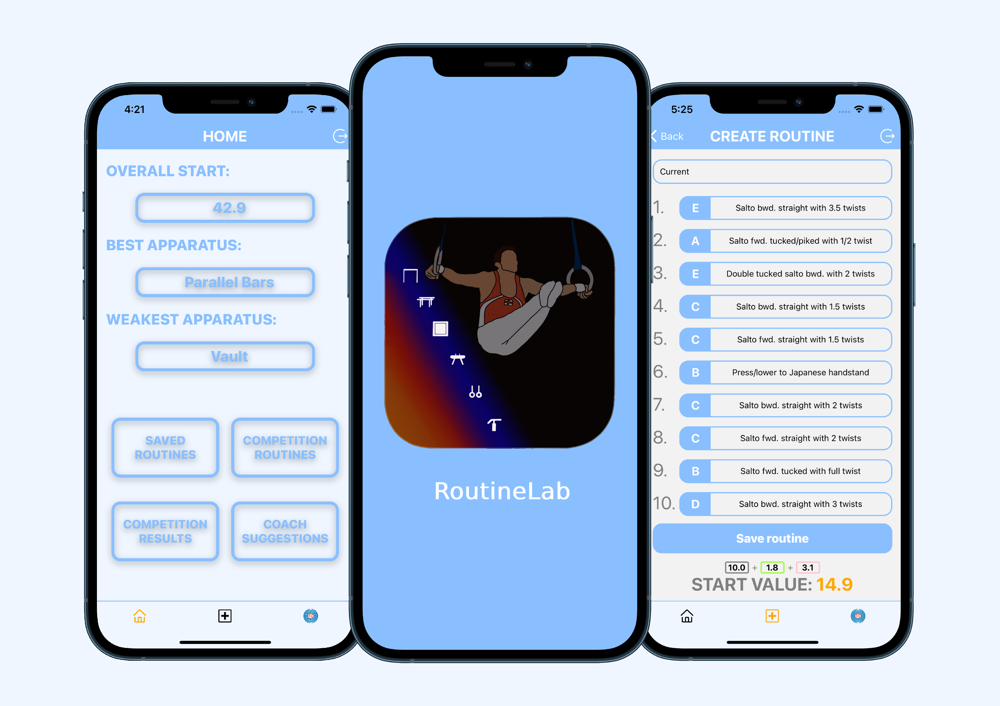
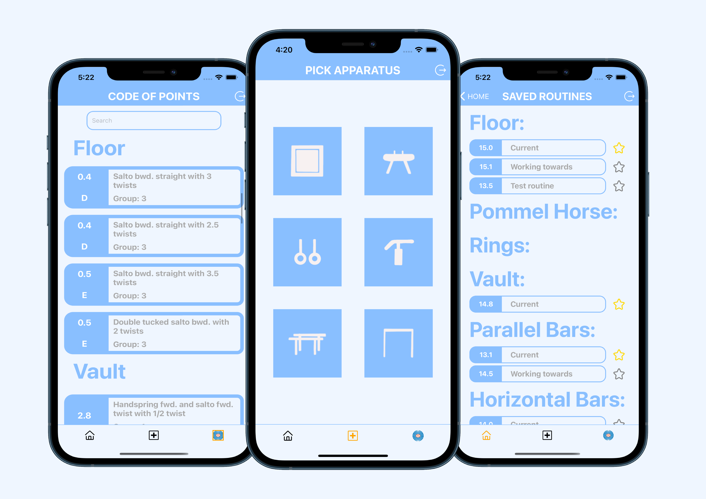

# RoutineLab

<p align="center">
  
</p>

RoutineLab is a mobile app for gymnasts to be able to build routines easily on their phone and have an overview of all their saved routines and current progress.

## Screenshots

<p align="center">
  
  
</p>

## Getting started

In order to work on the RoutineLab app you will need npm and Node. Follow the instructions below before starting with the installation.

- Xcode (latest version, at least >9.3). Install from App Store.
- [Expo XDE](https://www.expo.io) - the Expo development environment.
  `npm install -g exp`

## Installation

1. Clone this repo and enter!

   ```bash
   git clone https://github.com/hectorkd/RoutineLab.git
   cd RoutineLab
   npm install --global expo-cli
   ```

2. Install dependencies.

   ```bash
   cd server
   npm i
   cd ..
   cd client
   npm i
   ```

3. When you are in the client folder, run `exp start` to start the Expo development environment that will build the JS bundle for your app.

4. Run IOS simulator to open the app with expo.

## Tech Stack

### Front End

- [React Native](https://facebook.github.io/react-native/)
- [Expo](https://www.expo.io)
- [TypeScript](https://www.typescriptlang.org/)

### Back End

- [Express](https://expressjs.com/)
- [Node.js](https://nodejs.org/en/)
- [MongoDB](https://www.mongodb.com/)
- [Mongoose](https://mongoosejs.com/)
- [TypeScript](https://www.typescriptlang.org/)

## Observations

##### Room for improvements

- Better typing for TypeScript
- Write tests
- Adapt the UI design

##### Next orders

- Deploy RoutineLab to the app store and google play
- Add competition results
- Add collection of olympian routines
- Add a coaches side

## Contributors ✨

Thanks goes to these wonderful people ([emoji key](https://allcontributors.org/docs/en/emoji-key)):

<table>
  <tr>
     <td align="center" ><a href="https://github.com/hectorkd"><br /><sub><b><a href="https://www.linkedin.com/in/hector-kennedy-dyson/" title="linkedin">Hector Kennedy-Dyson</a></b></sub></a><br /><a href="https://github.com/hectorkd/RoutineLab/commits?author=hectorkd" title="Code">💻</a> <a href="#ideas-hector" title="Ideas & Planning">🤔</a> <a href="#review-hector" title="Reviewed Pull Requests">👀</a> <a href="#design-hector" title="Design">🎨</a> <a href="#maintain-hector" title="Maintenance">🚧</a> <a href="https://www.youtube.com/watch?v=RKsBLbWr3cg" title="Videos">📹</a></td>
  <tr>
        <table>
