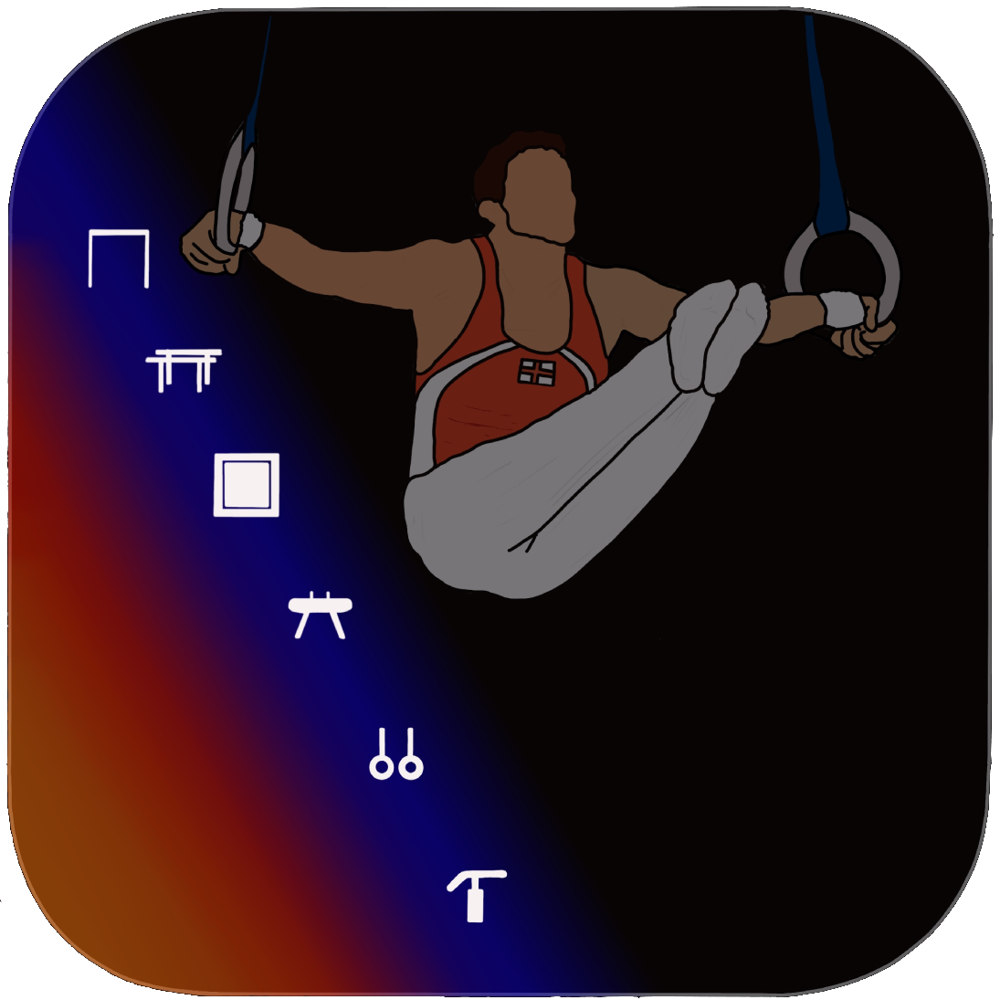
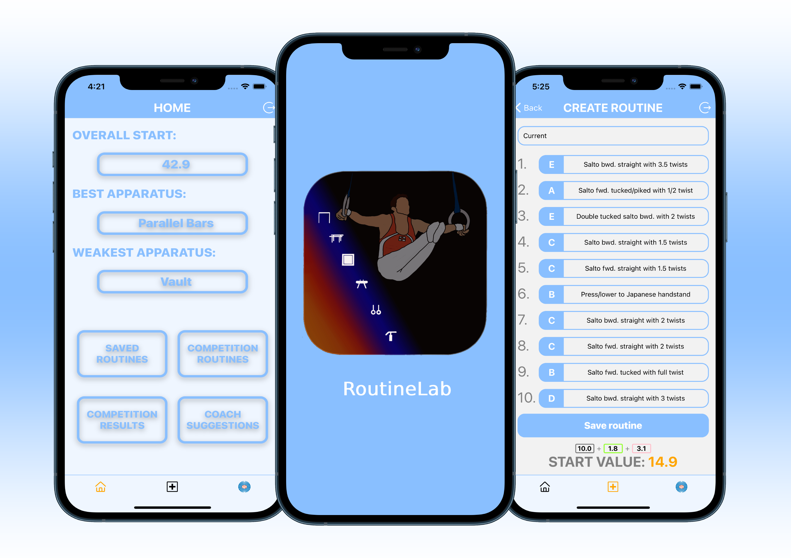
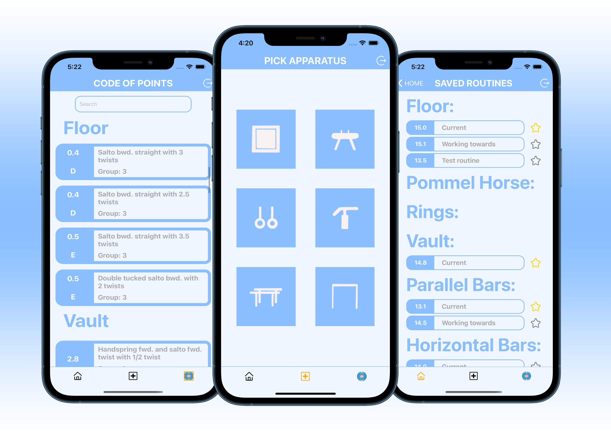

# RoutineLab

<p align="center">
  
</p>

RoutineLab is a mobile app for gymnasts to be able to build routines easily on their phone with and have an overview of their routines and current progress.

## Screenshots

<p align="center">
  
  
</p>

## Getting started

In order to work on the RoutineLab app you will need npm and Node. Follow the instructions below before starting with the installation.

- Xcode (latest version, at least >9.3). Install from App Store.
- [Expo XDE](https://www.expo.io) - the Expo development environment.
  `npm install -g exp`

## Installation

1. Clone this repo and enter!

   ```bash
   https://github.com/hectorkd/RoutineLab.git
   cd RoutineLab
   npm install --global expo-cli
   ```

2. Install dependencies.

   ```bash
   cd server
   npm i
   cd ..
   cd client
   npm i
   ```

3. When you are in the client folder, run `exp start` to start the Expo development environment that will build the JS bundle for your app.

4. Run IOS simulator to open the app with expo.

## Tech Stack

- [React Native](https://facebook.github.io/react-native/)
- [Express](https://expressjs.com/)
- [Mongoose](https://mongoosejs.com/)

## Developers

- Hector Kennedy-Dyson - [GitHub](https://github.com/hectorkd) - [LinkedIn](https://www.linkedin.com/in/hector-kennedy-dyson/)
